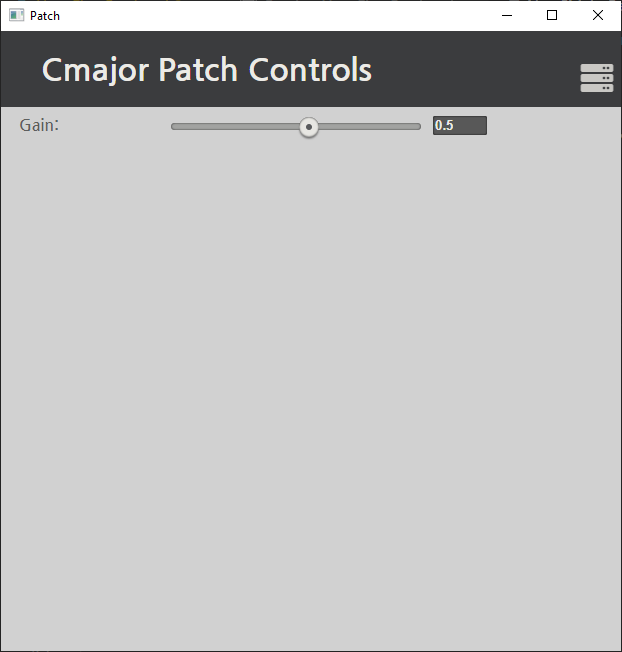

# Your First Patch - Hello, World!

Let's start with a simple gain slider patch. We'll breakdown the code as we go. There is of course, the gain within the standard library that does this for us, but this is a template example for passing in values from a user interface.

## Step 1 - Create a New Patch

Start by running:

Mac:
```
$ cmaj create HelloWorld
```

Windows:
```
.\cmaj create HellowWorld
```

This creates a new Cmajor patch we can start writing in. We start with a simple graph that plays a sine wave:

```cpp
graph helloWorld  [[main]]
{
    output stream float out;

    node sine = std::oscillators::Sine (float, 440);

    connection sine -> std::levels::ConstantGain (float, 0.15f) -> out;
}
```

Remove the connection line, we'll be adding this later!

## Step 2 - Create a Processor

For this patch, we multiply the inputted sine wave with a gain control within a processor. Copy and paste this processor below the graph:

```
processor gainProc{
    output stream float out;
    input stream float in;

    input value float gainValue;
    void main(){
        loop{
            out <- gainValue * in;
            advance();
        }
    }

}
```
Each processor must have a main function. This function is used to process the data by sample in a loop. The value of gain needs to be passed into the processor when it is connected via a graph.

## Step 3 - Add and Connect a Gain Slider

We can build on this to add a gain slider. The 'main' annotation when declaring a graph gives the top level graph, this is where the compiler starts when compiling the program. We define a new input value here. From our original 'helloWorld' graph, this gain value is added:

```
input value float gain[[name: "Gain", min: 0, max: 0.9, init: 0.5, step: 0.01]];
```

This creates an input value of type float. The parameters within the brackets are passed to the host to show parameters on screen. Play with these values to see how they work and change. Our graph should now look like this:

```
graph helloWorld  [[main]]
{
    output stream float out;
    input value float gain[[name: "Gain", min: 0, max: 0.9, init: 0.5, step: 0.01]];

    node sine = std::oscillators::Sine (float, 440);

    // Insert connections here.....
}
```

The next step is to connect this slider to the 'gainProc' processor we made. The connection portion of the graph is the 'plumbing' of streams of data. The connection branch within the helloWorld graph will look like this:

```
    connection{
        gain           -> gainProc.gainValue;

        sine           -> gainProc.in;
        gainProc.out   -> out;
    }
```

 This is where we can connect the sine wave, through to the gain processor, to the output stream. Alongside this, we can connect the inputted gain value, to the gain parameter in the processor. 
 
## Final Cmajor Code

 Altogether, the helloWorld Cmajor program we have created looks like:

 ```
graph helloWorld  [[main]]
{
    output stream float out;
    input value float gain[[name: "Gain", min: 0, max: 0.9, init: 0.5, step: 0.01]];

    node sine = std::oscillators::Sine (float, 440);
    
    connection{
        gain           -> gainProc.gainValue;

        sine           -> gainProc.in;
        gainProc.out   -> out;
    }
}

processor gainProc{
    output stream float out;
    input stream float in;

    input value float gainValue;
    void main(){
        loop{
            out <- gainValue * in;
            advance();
        }
    }
}
```

With the command line tool, play your new patch:

Mac:
```
$ cmaj play /path-to-your-repo/examples/HelloWorld/HelloWorld.cmajorpatch
```
Windows:
```
.\cmaj play /path-to-your-repo/examples/HelloWorld/HelloWorld.cmajorpatch
```

When you run the play command from the command line tool, you'll see a window pop up that looks like this:

<p align="left">
  
</p>

And there you go, your first Cmajor patch using a graph and processor!

-------------------------------------------------------------------------------

All content (C)2022 Sound Stacks Ltd.
