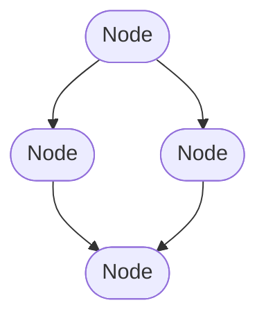

# Setting up Cmajor

To begin, you may want to follow this guide to setup Cmajor with command line tools. This will give you a whole guide to running your first Cmajor patch.

### Download the latest release of Cmajor Binaries

<span class="fs-8">
[Download](https://github.com/SoundStacks/cmajor/releases){: .btn .btn-outline }
</span>

In this releases tab, you'll see zip files of the binaries for Mac, Windows and Linux builds. Download the binaries you require. Unzip the file and create a folder to store your binaries in a place of your choosing.

```
/path-to-your-exe/cmajor
│_cmaj.exe
│_CmajPerformer.dll    
```

This sets you up with the `cmaj` executable file used to run command line tools and the dll `CmajPerformer.dll`. We will focus on the command line executable in this page.

-------------------------------------------------------------------------------
## Command-Line Tools

The command line tool for Cmaj allows for local creating, building and compiling of a patch, as well as generating C++ code. This document is a setup guide for downloading the Cmaj command-line tools.

For a deeper dive into the language syntax, library functionality and tool options, please see the other documentation.

### Running Cmajor Command Line Tools

Installing the command-line app is simply a case of copying the `cmaj` executable to a location of your choice, and running it.

For help, run

Mac:
```
$ cmaj help
```

Windows:
```
.\cmaj help
```

This creates a list of commands and arguments that can be passed into the command-line app, along with cmaj version details.

```
</path-to-your-exe> .\cmaj help

   ,ad888ba,                                88
  d8"'    "8b
 d8            88,dPba,,adPba,   ,adPPYba,  88
 88            88P'  "88"   "8a        '88  88
 Y8,           88     88     88  ,adPPPP88  88
  Y8a.   .a8P  88     88     88  88,   ,88  88
   '"Y888Y"'   88     88     88  '"8bbP"Y8  88
                                           ,88
                                         888P"
Cmajor Tools (C)2022 Sound Stacks Ltd.
https://cmajor.dev

cmaj <command> [options]    Runs the given command. Options can include the following:

    -O0|1|2|3               Set the optimisation level to the given value
    --debug                 Turn on debug output from the performer
    --sessionID=n           Set the session id to the given value
    --engine=<type>         Use the specified engine - e.g. llvm, wasm, cpp

Supported commands:

cmaj help                   Displays this help output

cmaj version                Displays the current Cmajor version

cmaj licenses               Print out legally required licensing details for 3rd-party
                            libraries that are used by this application.

cmaj play file [opts]       Plays a patch or executes a javascript script file.
                            See the supporting documentation for a guide to the options.

cmaj test [opts] <files>    Runs one or more .cmajtest scripts, and print the aggregate results
                            for the tests. See the documentation for writing tests for more info.

    --singleThread          Use a single thread to run the tests
    --threads=n             Run with the given number of threads, defaults to the available cores
    --runDisabled           Run all tests including any marked disabled
    --testToRun=n           Only run the specified test number in the test files
    --xmlOutput=file        Generate a JUNIT compatible xml file containing the test results
    --iterations=n          How many times to repeat the tests

cmaj render [opts] <file>   Renders the given file or patch

    --length=<frames>       The number of frames to render (optional if an input audio file is provided)
    --rate=<rate>           Use the specified sample rate (optional if an input audio file is provided)
    --channels=<num>        Number of output audio channels to render (default is 2 if omitted)
    --blockSize=<size>      Render in the given block size
    --output=<file>         Write the output to the given file
    --input=<file>          Use input from the given file
    --midi=<file>           Use input MIDI data from the given file

cmaj generate [opts] <file> Generates some code from the given file or patch

    --target=<type>         The type of code to generate - can be cpp|wasm|wast|module|syntaxtree
    --output=<file>         Write the generated runtime to the given file

cmaj create [opts] <folder> Creates a folder containing files for a new empty patch

    --name="name"           Provides a name for the patch

cmaj server [opts] <file>   Start running the patch server for the given file or patch

    --no-gui                Disable automatic launching of the UI in a web browser
    --url=address:port      Specifies the address and port to listen on

cmaj unit-test              Runs internal unit tests.

    --iterations=n          How many times to repeat the tests
```

## Playing a patch

To get started, you might want to try some of the example patches - these are found in the repo. For example, run

Mac:
```
$ cmaj play /path-to-your-repo/examples/HelloWorld/HelloWorld.cmajorpatch
```
Windows:
```
.\cmaj play /path-to-your-repo/examples/HelloWorld/HelloWorld.cmajorpatch
```

This will open a patch window

<p align="center">
  
</p>

While running, the patch will recompile when a change is detected.

## Creating a new patch

To create a new patch, run

Mac:
```
$ cmaj create newFolderName
```
Windows:
```
.\cmaj create newFolderName
```

This creates a new folder containing patches that can be renamed, moved and edited. From here, boilerplate code is given as an example, remove this as required and start building!

-------------------------------------------------------------------------------

## Main Concepts

This section focuses on the main concepts of the Cmajor programming language.

### Programs vs Patches

A Cmaj *program* refers to any collection of processors, graphs and namespaces. A host app can load a Cmaj program, instantiate a processor and use it to render data of any type.

A Cmaj *patch* is a program which follows some conventions to make it suitable for using as an audio plugin. A patch is bundle of program files, metadata and other resources (such as GUI scripts and audio files) which hosts can load and use like they might do a traditional plugin such as a VST or AU.


### Processors and Graphs

The main high-level concepts in Cmaj that differ from most other languages are the `processor` and `graph` objects. `Processor` nodes are linked together in a `graph` structure to create a larger graph layout.

Several `processor` nodes may `graph` together in clusters that are then fed into the main graph as one larger `processor` node.




### A `processor` contains:
- A list of inputs and outputs
- A `main()` function. This usually contains a loop which reads from its inputs, performs some kind of processing, and writes to its outputs
- Other helper functions, types, and state variables that are needed by the `main()` function

```
// Example of a processor declaration:
processor GainProcessor
{
    input  stream float in;    // declare an input and output stream of floats
    output stream float out;

    void main()
    {
        loop   // infinite loop
        {
            out << in * 0.5f;  // read our next input value, multiply by 0.5, and send it to our output
            advance();         // advance to the next frame
        }
    }
}
```

### A `graph` contains:
- A list of inputs and outputs
- A list of `node` declarations, which defines the set of processors (or sub-graphs) used by the graph
- A list of `connection` declarations, which define how the nodes are connected together

```
// Example of a graph declaration:
graph TwoGainsInSeries
{
    input  stream float in;
    output stream float out;

    node gain1 = GainProcessor;  // declare two nodes, each one a GainProcessor
    node gain2 = GainProcessor;

    connection in -> gain1 -> gain2 -> out;  // send our input through both gains, and the result to our output
}
```

A program can also contain `namespace` declarations containing functions, data types, and constants that the processors can use.

## Your First Patch - Hello, World!

Let's start with a simple gain slider patch. We'll breakdown the code as we go. There is of course, the gain within the standard library that does this for us, but this is a template example for passing in values from a user interface.

### Step 1 - Create a New Patch

Start by running:

Mac:
```
$ cmaj create HelloWorld
```

Windows:
```
.\cmaj create HellowWorld
```

This creates a new Cmajor patch we can start writing in. We start with a simple graph that plays a sine wave:

```
graph HelloWorld  [[main]]
{
    output stream float out;

    node sine = std::oscillators::Sine (float, 440);

    connection sine -> std::levels::ConstantGain (float, 0.15f) -> out;
}
```

Remove the connection line, we'll be adding this later!

### Step 2 - Create a Processor

For this patch, we multiply the inputted sine wave with a gain control within a processor. Copy and paste this processor below the graph:

```
processor GainProc
{
    output stream float out;
    input stream float in;

    input value float gainValue;
    void main(){
        loop{
            out <- gainValue * in;
            advance();
        }
    }
}
```
Each processor must have a main function. This function is used to process the data by sample in a loop. The value of gain needs to be passed into the processor when it is connected via a graph.

### Step 3 - Add and Connect a Gain Slider

We can build on this to add a gain slider. The 'main' annotation when declaring a graph gives the top level graph, this is where the compiler starts when compiling the program. We define a new input value here. From our original 'helloWorld' graph, this gain value is added:

```
input value float gain[[name: "Gain", min: 0, max: 0.9, init: 0.5, step: 0.01]];
```

This creates an input value of type float. The parameters within the brackets are passed to the host to show parameters on screen. Play with these values to see how they work and change. Our graph should now look like this:

```
graph HelloWorld  [[main]]
{
    output stream float out;
    input value float gain[[name: "Gain", min: 0, max: 0.9, init: 0.5, step: 0.01]];

    node sine = std::oscillators::Sine (float, 440);

    // Insert connections here.....
}
```

The next step is to connect this slider to the 'gainProc' processor we made. The connection portion of the graph is the 'plumbing' of streams of data. The connection branch within the helloWorld graph will look like this:

```
    connection
    {
        gain         -> gainProc.gainValue;
        sine         -> gainProc.in;
        gainProc.out -> out;
    }
```

 This is where we can connect the sine wave, through to the gain processor, to the output stream. Alongside this, we can connect the inputted gain value, to the gain parameter in the processor. 
 
### Final Cmajor Code

 Altogether, the helloWorld Cmajor program we have created looks like:

 ```
graph HelloWorld  [[main]]
{
    output stream float out;
    input value float gain[[name: "Gain", min: 0, max: 0.9, init: 0.5, step: 0.01]];

    node sine = std::oscillators::Sine (float, 440);
    
    connection{
        gain         -> gainProc.gainValue;
        sine         -> gainProc.in;
        gainProc.out -> out;
    }
}

processor GainProc
{
    output stream float out;
    input stream float in;

    input value float gainValue;
    void main(){
        loop{
            out <- gainValue * in;
            advance();
        }
    }
}
```

With the command line tool, play your new patch:

Mac:
```
$ cmaj play /path-to-your-repo/HelloWorld/HelloWorld.cmajorpatch
```
Windows:
```
.\cmaj play /path-to-your-repo/HelloWorld/HelloWorld.cmajorpatch
```

When you run the play command from the command line tool, you'll see a window pop up that looks like this:

<p align="left">
  
</p>

And there you go, your first Cmajor patch using a graph and processor!

-------------------------------------------------------------------------------
